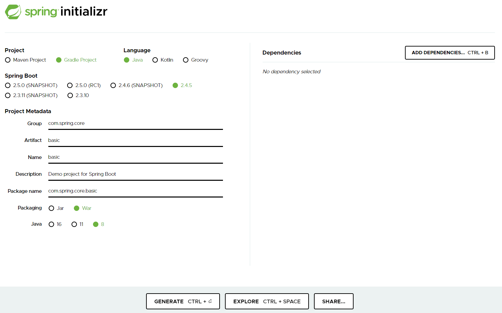

#스프링 코어 학습
- [스프링프로젝트 설정 링크] (https://start.spring.io/)
- 
##Lombok 설정
```groovy
//lombok 라이브러리
	compileOnly group: 'org.projectlombok', name: 'lombok', version: '1.18.12'
	annotationProcessor group: 'org.projectlombok', name: 'lombok', version: '1.18.12'
```
1. 인텔리제이 프러그인 lombok설치
1. 설정에 annotation processor 검색 -> 아노테이션 활성화 체크